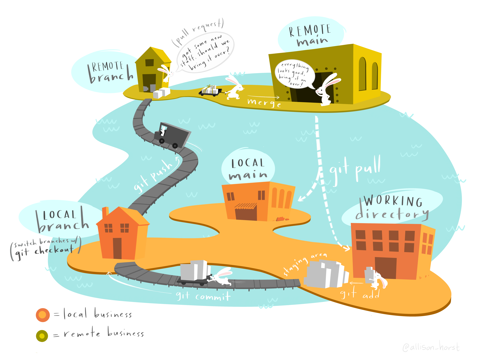

# Github 4/25/23

## Agenda
* 7:00 - 8:00 Github Lecture / Announcements
* 8:00 - 8:30 Github group activity
* 8:30 - 8:45 Break
* 8:45 - 10:00 Lab / Flex-time

## Today's Lab
[Github lab](https://github.com/10-2-pursuit/lab-github)

## Quick Git Reference

### Key Terms
- What is `git` - why do we use `git`?
"A secondary placewhere we can keep code that we are still working on && collaborating on" - Brandon H
it's a `version control` - it controls what state our code is in at a certain time and it lets us revert to that state

"In case of mistakes" - E Mohr
we use git to allow us to revert BACK to a safe place in our code
additionally it allows us to control the state of code when many different devs are working on it

- What is `github`? how are they different? 
'Github is a platofrm that lets other works together on a project' - Elisaul Batista
Is a website where we can all share and mutually access git repositories;
We use GH in developement to organize and share git;
- What is a `commit`?
A commit is when we 'save' our local git repository and update the code;
- What is a `branch`?
a branch is a parellel copy of the same code 
in this code we can track any work we wanna do without changing the code of the 'main'
each Github repo has either a 'master' or a 'main' branch that represents the MAIN branch
- What is a `local branch`?
Local - means only on my machine;  SO a local branch is only available on my machine- not on github
- What is a `local remote branch`?
Local branch that was pushed to the github repo;
ex: If Emily owns the repo and Dwayne is working on a branch locally - he can push his local and it will create a branch up on github under Emily's project;

### Git Illustrated

## Today's Pairs
1. Aisha Kleemoff, Kanique Cox
2. Dwayne Jones, Shanice Griffin
3. Michael Caldwell, Emily Mohr
4. Mikal Wazeerud-Din, Addis Jackson
5. Ruslan Poptsov, Areebur Rahman
6. Nasser Said Martinez Puerta, Davon Bridgett
7. Brandon Harris, Joseph Carter
8. Sung Yi, Alexander Tsiklidis
9. Christopher Baker, Nicole Slater
10. Anthony Huarneck, Erick Tolentino
11. Kenny Mercedes, Keith Camacho
12. Genesis Lara, Anile Choice
13. Elisaul Batista, Jalal Jonaid
14. Winder Joel Marte, Erick Martinez
