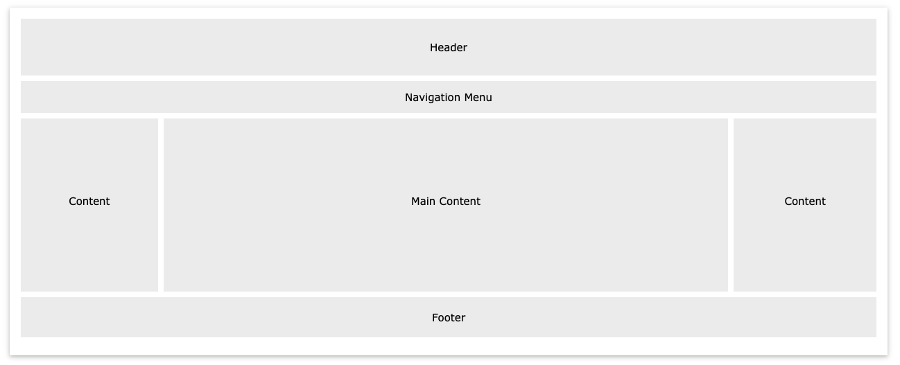

# CSS Grid
# **topic** **date**

## Quote of The Day
“I choose a lazy person to do a hard job. Because a lazy person will find an easy way to do it.”
― Bill Gates

## Agenda
* 9:00 - 10:30 CSS selectors lab
* 10:30 - 10:50 Grid Pair Challenge
* 10:50 - 11:50 Grid lecture
* 11:50 - 12:00 Break
* 12:00 - 1:00 Grid lab / flex time 


## Today's Pairs 
1. Elisaul Batista, Mikal Wazeerud-Din
2. Joseph Carter, Shanice Griffin
3. Areebur Rahman, Tonesha Rose
4. Genesis Lara, Jefferson Chua
5. Aisha Kleemoff, Winder Joel Marte
6. Sung Yi, Nicole Slater
7. Addis Jackson, Keith Camacho
8. Michael Caldwell, Ana Torres
9. Davon Bridgett, Mayi Gomez
10. Dwayne Jones, Erick Tolentino
11. Alexander Tsiklidis, Franklin Rendon-Ramirez
12. Ruslan Poptsov, Anthony Huarneck
13. Kanique Cox, Jalal Jonaid
14. Anile Choice, Emily Mohr


## Group activity

Together with your lab partner spend 20 minutes to attempt to create the following mockup using the provided files
Imagine you want to create the following layout. How can you use CSS Grid to help in the implementation of this mockup?

  


### Key Terms

1. **Display**: The CSS `display` property specifies how an element should be rendered on the web page. It determines the type of box used for an element and how it interacts with other elements.

2. **Block**: Elements with a `display` value of `block` generate a block-level box. They start on a new line and occupy the full width available by default. Block-level elements can have dimensions (width, height) and can have margin, padding, and border properties.

3. **Inline**: Elements with a `display` value of `inline` generate an inline-level box. They do not start on a new line and only occupy the space necessary for their content. Inline-level elements do not have dimensions and do not accept margin, padding, or border properties.

4. **Inline-block**: Elements with a `display` value of `inline-block` combine features of both block and inline elements. They generate an inline-level box but can have dimensions (width, height) and accept margin, padding, and border properties. Inline-block elements flow inline with other content while retaining their block-like properties.

5. **Row**: The concept of rows is often associated with CSS grid or flexbox layouts. In CSS grid, rows are created by defining the grid container's `grid-template-rows` property. Rows contain grid items that can be placed in specific cells within the grid.

6. **Column**: Similarly to rows, columns are associated with CSS grid or flexbox layouts. In CSS grid, columns are created by defining the grid container's `grid-template-columns` property. Columns contain grid items that can be placed in specific cells within the grid.

These concepts are fundamental to understanding and controlling the layout and behavior of elements in CSS.


### Quick Reference
<div style="display: flex;  border:2px solid">
<table>
  <thead>
    <tr>
      <th>Property</th>
      <th>Description</th>
    </tr>
  </thead>
  <tbody>
    <tr>
      <td>grid-template-columns</td>
      <td>Defines the size and number of columns in a grid container</td>
    </tr>
    <tr>
      <td>grid-template-rows</td>
      <td>Defines the size and number of rows in a grid container</td>
    </tr>
    <tr>
      <td>grid-gap</td>
      <td>Specifies the size of the gap between grid items</td>
    </tr>
    <tr>
      <td>grid-column-start</td>
      <td>Specifies the start position of a grid item within a grid column</td>
    </tr>
    <tr>
      <td>grid-column-end</td>
      <td>Specifies the end position of a grid item within a grid column</td>
    </tr>
    <tr>
      <td>grid-row-start</td>
      <td>Specifies the start position of a grid item within a grid row</td>
    </tr>
    <tr>
      <td>grid-row-end</td>
      <td>Specifies the end position of a grid item within a grid row</td>
    </tr>
    <tr>
      <td>grid-column</td>
      <td>Shorthand for setting both grid-column-start and grid-column-end</td>
    </tr>
    <tr>
      <td>grid-row</td>
      <td>Shorthand for setting both grid-row-start and grid-row-end</td>
    </tr>
    <tr>
      <td>justify-items</td>
      <td>Aligns grid items along the inline (row) axis within their grid cells</td>
    </tr>
    <tr>
      <td>align-items</td>
      <td>Aligns grid items along the block (column) axis within their grid cells</td>
    </tr>
    <tr>
      <td>justify-content</td>
      <td>Aligns grid items along the inline (row) axis within the grid container</td>
    </tr>
    <tr>
      <td>align-content</td>
      <td>Aligns grid items along the block (column) axis within the grid container</td>
    </tr>
    <tr>
      <td>grid-auto-columns</td>
      <td>Defines the size of implicitly created columns in the grid</td>
    </tr>
    <tr>
      <td>grid-auto-rows</td>
      <td>Defines the size of implicitly created rows in the grid</td>
    </tr>
    <tr>
      <td>grid-auto-flow</td>
      <td>Specifies how auto-placed items are inserted in the grid</td>
    </tr>
  </tbody>
</table>

</div>


## Guiding questions

- What problem does `grid` attempt to solve?

- What property-value pair must you add to a parent element to have all of its children elements act as if they are in a grid?

- How do the CSS properties `grid-template-columns` and `grid-template-rows` affect the grid? Are they placed on the parent element or children element?

- Describe the following CSS and how it will affect each child element inside of the `container` element.

  ```css
  .container {
    display: grid;
    grid-template-columns: 200px 100px 400px;
    grid-template-rows: 50px 300px 200px;
  }
  ```


  How might CSS Grid be used to help in the implementation of this page?

- Take a look at [this repl](https://replit.com/@Pursuit/CSS-Grid-Nested-Grid-Example) which makes use of a grid inside of another grid. Describe what is happening and how it works.

- Try adding the following CSS to the repl above.

  ```css
  .container.child {
    grid-template-columns: repeat(3, 1fr);
  }
  ```

  How does this visually change the page? Why?

- How do you add gaps to your grid?

- How can you apply a minimum size to your grid elements?


