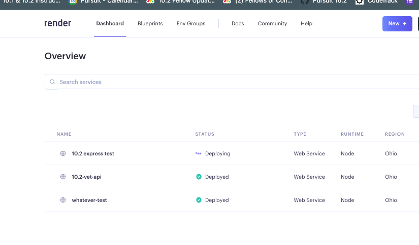
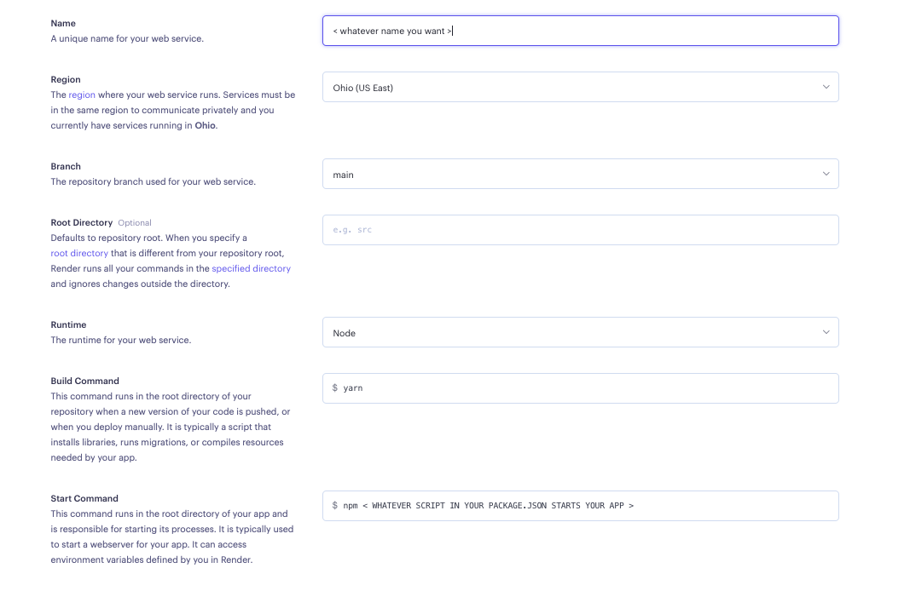
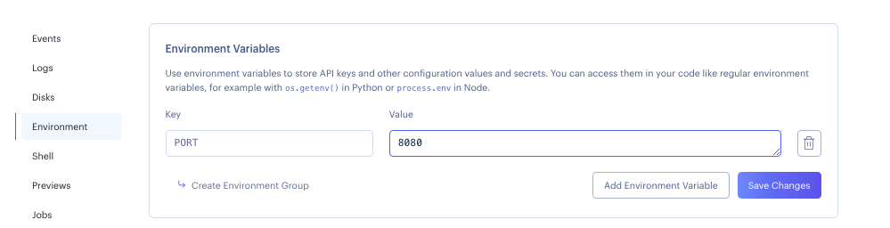
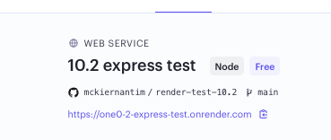

# Hosting Your Server with Render.io
Render.io is a cloud platform that makes it easy to deploy and manage web applications, including backend servers. It provides a seamless experience for hosting servers, allowing developers to focus on building their applications. Render.io offers a variety of features including automatic scaling, SSL encryption, and straightforward deployment workflows.

## Using Render.io for Hosting:
1. Create a Web Service: Begin by creating a new web service on Render. Connect your GitHub repository containing your backend code. Set up essential configurations like environment, region, and build settings.

2. Configure Environment Variables: Render.io allows you to securely store environment variables for your application. This is crucial for storing sensitive information like API keys or database credentials. These variables can be set in the Render.io dashboard.

3. Deployment and Scaling: Render.io automatically manages deployments and scaling. Changes to your codebase trigger automatic redeployments.
## Getting Started with Deployment

Follow these steps to deploy your Express server on Render:

### 1. Log in to Render with GitHub

Ensure you have a GitHub account and log in to Render using your GitHub credentials.

### 2. Create a New Web Service

- Click on the "+ New" button at the top of the Render site.
- Select "Web Service" from the options.

 
### 3. Connect Your Repository

- Choose "Connect a Repository".
- Use your version of the PERN Final Project Template (make sure it's public on GitHub).

### 4. Configure Your Web Service

You'll now be in a new view where you need to set up the fields correctly:

- **App Name**: Create a unique name for your app. This name will be included in the public URL to share with people.

- **Root Directory**: Use "back-end" as the root directory.

- **Environment**: Select "Node" as the environment.

- **Region**: Choose a region in the United States, preferably one on the East Coast.

- **Branch**: Select "main" as the branch.

- **Build Command**: Enter `yarn` (without any arguments).

- **Start Command**: Enter `node server.js`.

- **Plan**: Select the free plan.

### 5. Build Your App

Press the button to start the build process.

### 6. Add Environment Variables

Setting Environment Variables:

In your Render.io dashboard, go to the "Environment" tab for your web service.
Add your environment variables with their corresponding values.

### 7. Check for Errors

Look through the build logs. If you see any messages indicating a build failed or other errors, you'll need to go to the settings tab and review your configurations. If you made modifications to the template before deploying it, double-check that no changes affected the build and deployment process.

### 8. Automatic Redeployment

Once everything is set up, your app will automatically redeploy whenever you make a change to your main branch.

### 9. Access Your App

Go to your app by clicking the link provided at the top of the app on Render. 

## Connecting Your React App to Render.io

To connect your React app with its environment variables hosted on Render.io:

1. **React Environment Variables**:
   - Create a `.env` file in your React app's root directory.
   - Define your environment variables like `VITE_API_URL=your_render_service_url`.

2. **Accessing Environment Variables in React**:
   - In your React components, you can access environment variables using `process.env.VITE_API_URL`.

3. **Deployment on Netlify**:
   - Ensure that your React app is configured to fetch data from your Render.io backend.

Remember to keep your environment variables secure and never expose sen