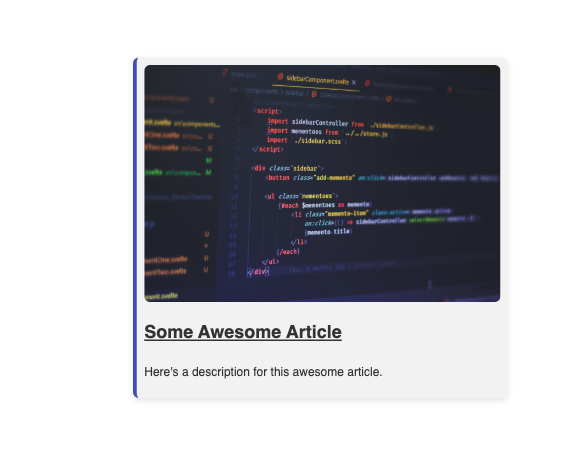

# Create a Card Component

## Objective:
Your challenge today is to create a basic "Card" component using HTML and CSS. A card is a common UI element used in web development to display concise information or content in a visually appealing way.

## Card Styling:
- **Font**: Use 'Google Sans', sans-serif, system-ui for text inside the card.
- **Background Color**: Use a light gray background color (#f2f2f2) for the card.
- **Box Shadow**: Apply a subtle box shadow to the card for a lift effect (0 4px 8px rgba(0, 0, 0, 0.1)).
- **Padding**: Set the padding inside the card to 10px.
- **Text Color**: Use a dark gray text color (#333) for the card content.
- **Left Border**: Add a 5px solid border on the left side of the card with an indigo color (#3f51b5).
- **Card Size**: The maximum width of the card should be 500px to avoid excessive width.

## Getting Started:
1. Create a new HTML file and link it to an external CSS file.
2. Define the basic structure of the card using HTML elements.
3. Apply CSS styles to achieve the desired appearance of the card.

## Time Limit:
You have 30 minutes to work on this challenge. Feel free to collaborate with your classmates and ask questions if you need help.

**Good luck and happy coding!**
